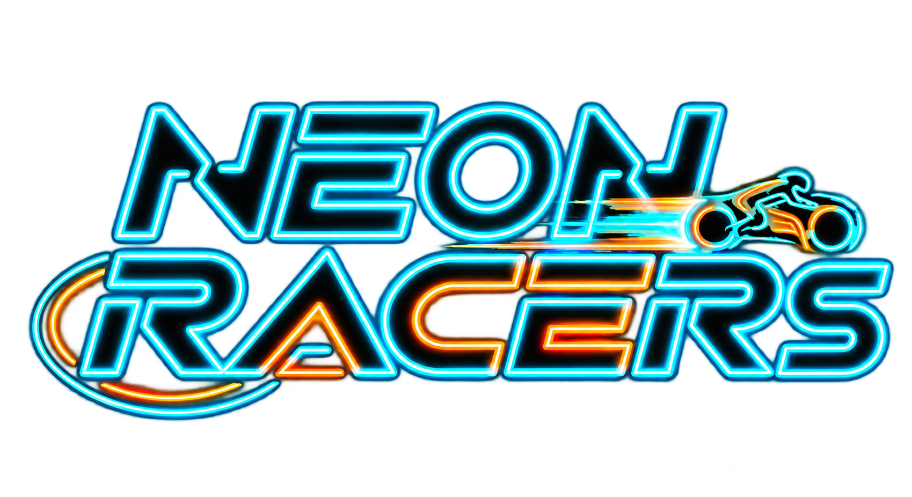
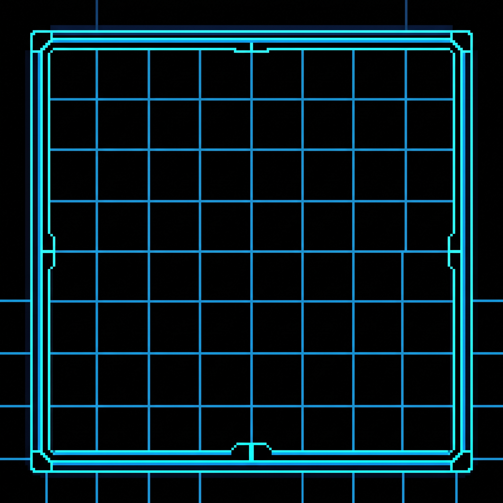
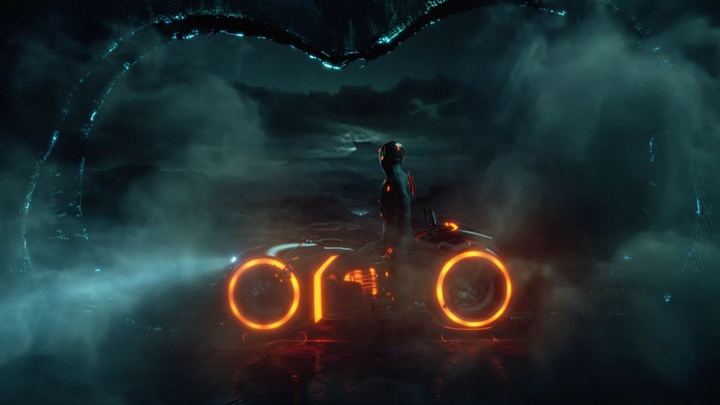
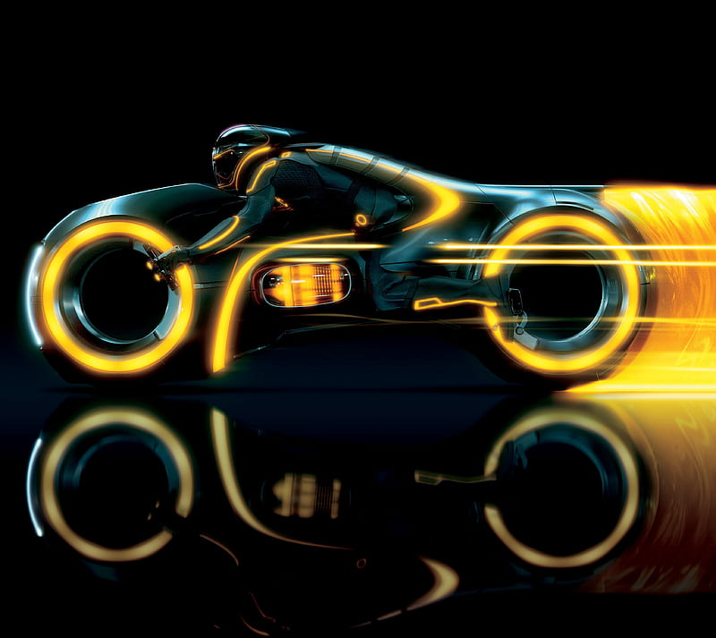
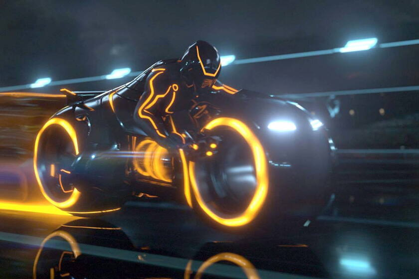
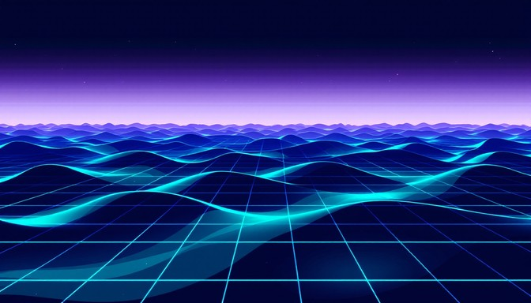
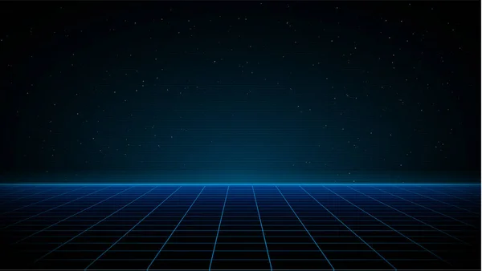
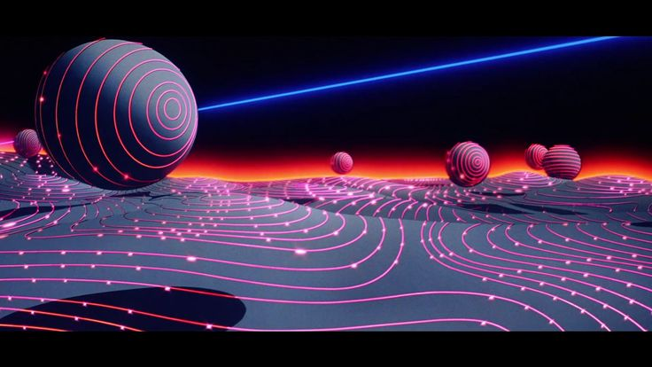
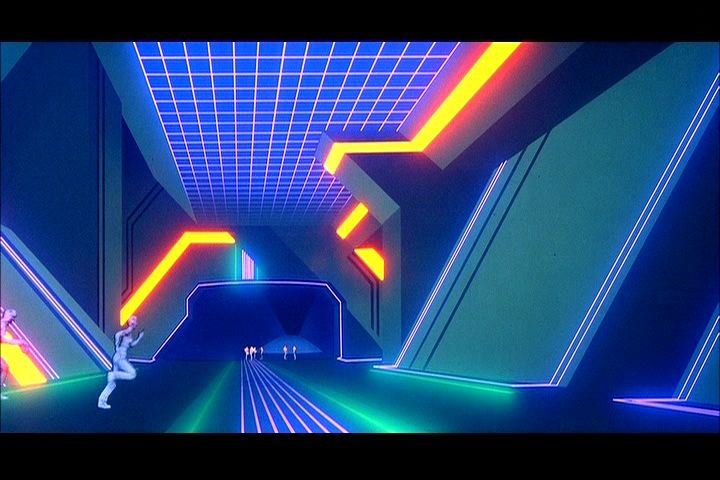
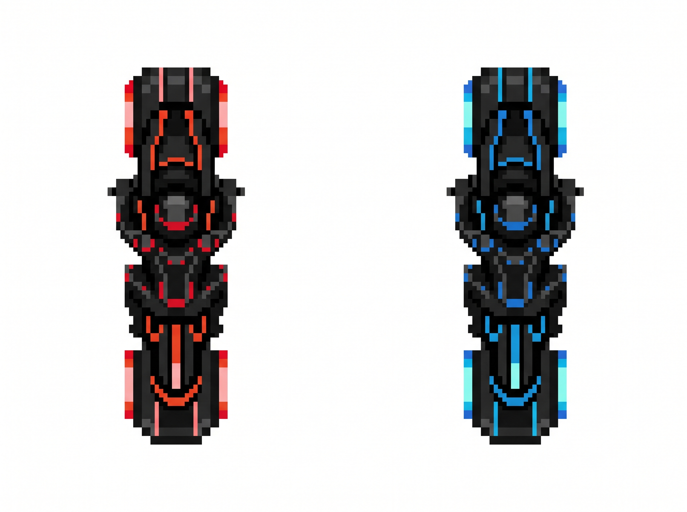

# Game Design Document (GDD)

## Índice

1. [Introducción](#1-introducción)
2. [Especificaciones básicas](#2-especificaciones-básicas)
3. [Jugabilidad](#3-jugabilidad)
4. [Narrativa](#4-narrativa)
5. [Imagen y diseño visual](#5-imagen-y-diseño-visual)
6. [Sonido](#6-sonido)
7. [Interfaz y diagrama de flujo](#7-interfaz-y-diagrama-de-flujo)
8. [Comunicación y marketing](#8-comunicación-y-marketing)
9. [Referencias](#9-referencias)

---

## 1\. Introducción

### 1.1. Concepto del juego

Neon Racers es un juego de PVP para dos jugadores en el que los jugadores tienen que hacer que el otro se choque con su estela para poder ganar. La idea principal es recrear el famoso juego de Tron y añadirle unos power ups que nos diferencien del real.

### 1.2. Propuesta de valor

¿Qué hace diferente a vuestro juego? Nuestro juego se diferencia de otros por la inclusión de poderes o “power-ups” con distintos efectos.

* Característica diferencial 1: Power-Ups de velocidad.  
* Característica diferencial 2: Power-Ups de inmortalidad.  
* Característica diferencial 3: Power-Ups de eliminar trazas.  
* Característica diferencial 4: Power-Ups de Congelar al otro jugador.

   
Figura 1. Imagen promocional del juego.  

## 2\. Especificaciones básicas

| Aspecto | RetroWave |
| :---- | :---- |
| Título | Neon Racers |
| Género | Acción |
| Número de jugadores | 2 (en red, tiempo real) |
| Público objetivo | Todos los públicos |
| Clasificación PEGI | PEGI \+7 (violencia leve) |
| Plataforma | Navegador web (PC), desarrollado con Phaser 3 |
| Duración de una partida | 2 minutos |
| Representación | 2D |
| Licencia | Apache 2.0 |

---

## 3\. Jugabilidad

### 3.1. Objetivo del juego

El objetivo de cada jugador es crear una estela con su moto para conseguir que el rival se choque con ella. La partida termina cuando un jugador choca con la estela de su rival o cuando ambos jugadores colisionan entre ellos. Gana el jugador que no se choque con la estela de su rival. Cuando ambos jugadores colisionan entre sí, pierden ambos.

### 3.2. Controles

| Acción | Jugador 1 | Jugador 2 |
| :---- | :---- | :---- |
| Moverse a la izquierda | A | ← |
| Moverse a la derecha | D | → |
| Moverse hacia arriba | W | ↑ |
| Moverse hacia abajo | S | ↓  |
| Pausa | Esc | Esc |

### 3.3. Mecánica

#### 3.3.1. Mecánicas principales

* Movimiento del jugador: el personaje jugable tiene un movimiento fijo en una dirección. El jugador puede cambiar la dirección pulsando WASD o las flechas direccionales (un jugador usa WASD y el otro las flechas direccionales).   
* Traza: El jugador crea una estela detrás suya que al contacto con otro jugador hace que este pierda.  
* Power-ups: Cada x segundos (varía según el objeto) aparece un objeto recolectable en una posición aleatoria del mapa. Cuando un jugador toca un objeto, obtiene un power-up que se activa automáticamente

#### 3.3.2. Objetos y power-ups

| Objeto | Efecto | Duración | Aparición |
| :---- | :---- | :---- | :---- |
| Velocidad | Proporciona una mayor velocidad al jugador  | 2 s | Aleatoria cada 5 s |
| Inmortalidad  | Permite al jugador atravesar trazas de otros jugadores. | 2 s | Aleatoria cada 5 s |
| Eliminador de trazas  | Elimina todas las trazas del mapa  | Instantáneo | Aleatoria cada 5 s |
| Congelación | Congelas al otro jugador | 2 s  | Aleatoria cada 5 s |
| Traza Aumentada | La traza del jugador dura más tiempo | 2 s | Aleatoria cada 10 segundos |

#### 3.3.3. Sistema de puntuación

El juego contabiliza el número de partidas que ha ganado cada jugador. Este contador se encuentra en la parte superior de la pantalla y se resetea cada vez que reinicias el juego. 

### 3.4. Físicas y dificultad

Rúbrica — Jugabilidad / Físicas: físicas variadas con elementos de dificultad.

* Colisiones: Las estelas colisionan con los jugadores (el jugador pierde al colisionar con la estela). Los jugadores también colisionan entre ellos (ambos jugadores pierden). Los jugadores colisionan con las paredes del escenario (el jugador se queda parado hasta cambiar de dirección).  
* Progresión de la dificultad: a medida que avanza la partida, aumenta la frecuencia en la que aparecen los power-ups (Aumenta un 50% cada 30 segundos de partida, hasta un máximo de 200%).

### 3.5. Escenario

Rúbrica — Jugabilidad / Calidad del escenario.  
El escenario representa un. Se compone de 3 zonas:

1. Zona Roja: El fondo es negro con bordes rojos.  
2. Zona Azul: El fondo es negro con bordes azules.  
3. Zona Naranja: El fondo es negro con bordes naranjas.

 

Figura 2\. Mapa del escenario con zonas de aparición, plataformas y obstáculos.

## 4\. Narrativa

### 4.1. Historia

En el Madrid distópico de 2043, el *Neon Circuit* de Gran Vía es el espectáculo *underground* más codiciado de la ciudad. Carlos y Javier llevan una década compitiendo en el circuito, alimentando una rivalidad que no ha parado de crecer. Tras abrirse paso entre docenas de pilotos en el torneo anual, hoy se ven las caras en la gran final: un único enfrentamiento a máxima velocidad donde solo uno se convertirá en leyenda.

### 4.2. Personajes

#### Carlos (Jugador 1\)

![][image2]

* Edad y origen: 29 años. Francés con raíces alemanas.  
* Personalidad: Narcisista, impulsivo y con un ego desproporcionado.  
* Motivación: Demostrar su superioridad absoluta y humillar a su eterno rival en el circuito.  
* Trasfondo: Hijo de una familia con alto poder adquisitivo, Carlos creció con la creencia de ser un ser superior destinado a la grandeza. A los 14 años comenzó a practicar Neon Racers, donde descubrió tener un talento abismal. Ganó todos los torneos en los que participó, hasta que, con 19 años, sufrió su primera derrota al enfrentarse a Javier en la primera ronda del torneo de Roma, donde fue aplastado de una forma humillante. Incapaz de encajar ese fracaso, convirtió su pasión en una obsesión personal hacia Javier, dispuesto a perseguirlo y vencerlo eternamente.

#### Javier (Jugador 2\)

![][image3]

* Edad / origen: 33 años. Español con raíces nigerianas.  
* Personalidad: Humilde, metódico y trabajador.  
* Motivación: Dedicarse profesionalmente al deporte que ama para asegurar su futuro.  
* Trasfondo: Criado en un barrio humilde de Sevilla, Javier se enamoró de Neon Racers a los 4 años tras ver una retransmisión por televisión. Pasó toda su infancia imaginando como sería competir en los circuitos de neón mientras ahorraba euro a euro durante casi dos décadas. Con 22 años finalmente consiguió su primera moto de competición y comenzó a practicar el deporte. Con 23 años, tan solo un año después, participó por primera vez en un torneo, el torneo de Roma. Allí, eliminó en la primera ronda a Carlos, sorprendiendo al mundo eliminando a su gran favorito, iniciando así una rivalidad que pasaría a ser considerada historia del deporte mundial. Desde entonces, ha mantenido una carrera constante de esfuerzo y sacrificio.

---

## 5\. Imagen y diseño visual

### 5.1. Logotipo

Rúbrica — Imagen / Logotipo.  
![][image1]  
Figura 3\. Logotipo del juego. Tipografía: AAA. Concepto: AAA AAA AAA.

### 5.2. Estilo visual

Rúbrica — Imagen / Estilo visual: pixel art.  
El juego utiliza un estilo pixel art de 64x64 píxeles porque queremos detallar los modelos de las motos y sus corredores.  
El juego utiliza un estilo Retro Wave.

### 5.3. Uso de colores

Rúbrica — Imagen / Descripción visual: uso de colores vibrantes junto a negros absolutos.  
  
Figura 4\. Paleta de colores del juego.

* Fondo (\#030504 ): Negro, con líneas rojas neón, azules neón y naranjas neón (según el mapa).  
* Jugador 1 (\#00A3E0): Azul neón / Jugador 2 (\#FF073A): Rojo neón. Colores complementarios para distinguir fácilmente a cada jugador.  
* Trazas: Azul neón (jugador 1\) y rojo neón (jugador 2\)  
* Objetos (\#F5C518): Velocidad: Amarillo neón. Inmortalidad: Gris neón. Eliminador de trazas: Verde neón. Congelación: Azul celeste neón. Traza aumentada: Rosa neón.

### 5.4. Aspectos técnicos: cámara y representación

Rúbrica — Imagen / Aspectos técnicos: uso de cámara y 2D/3D.

* Representación: 2D, con vista cenital  
* Cámara: Fija, mostrando todo el escenario.  
* Resolución base: 1080 × 1080 píxeles.

### 5.5. Inspiración artística y cultural

Rúbrica — Imagen / Inspiración: referentes artísticos y culturales y vínculo con otros trabajos.  
  
Figura 5\. Moodboard con las referencias visuales.

* Tron Legacy (2010) (película): Ciencia ficción/Acción.
 
 
 
* Retro wave (referencia cultural): nostalgia de la cultura pop y la tecnología de los años 80\.
 
 
* Tron (1982) (película): Acción
 
 
### 5.6. Bocetos de personajes y pantallas
  
Rúbrica — Imagen / Bocetos: interfaz de menú, pantallas y personajes.  
Los bocetos de los personajes se encuentran en el apartado [4.2](https://github.com/MRTN0624/Neon-Racer/blob/main/READMEejemplo.md#42-personajes) y los de las pantallas en el apartado [7.1](https://github.com/MRTN0624/Neon-Racer/blob/main/READMEejemplo.md#71-pantallas).  
---

## 6\. Sonido

Rúbrica — Sonido: música y efectos.

### 6.1. Banda sonora

| Pista | Escena | Estilo / ambiente | Fuente / licencia |
| :---- | :---- | :---- | :---- |
| 001 | Menú principal | Retrowave \- 8 bit | https\://youtu.be/TtlLKbFMeuU |
| 002 | Partida | Retrowave \- 8 bit | https\://youtu.be/zljRr4nFLIc |
| 003 | Victoria | Retrowave \- 8 bit | https\://youtu.be/s4p-D93jydw |

### 6.2. Efectos de sonido

| Efecto | Momento en que se reproduce |
| :---- | :---- |
| Movimiento | Al moverse un personaje |
| Impacto | Al chocar un personaje con una estela |
| Recoger objeto | Al tomar un personaje un objeto |
| Power-up | Al tener un personaje un power-up |
| Botones de la interfaz | Al pasar el ratón y al hacer clic |

---

## 7\. Interfaz y diagrama de flujo

### 7.1. Pantallas

Menú principal  
  
Figura 6\. Menú principal: AAA AAA AAA.  
Pantalla de juego (HUD)  
  
Figura 7\. Pantalla de juego: AAA AAA AAA.  
Ajustes y fin de partida  
   
Figura 8\. Pantalla de ajustes (izquierda) y fin de partida (derecha).

### 7.2. Diagrama de flujo

Rúbrica — Documento / Diagrama de flujo. Podéis usar Mermaid (GitHub lo renderiza directamente) o una imagen exportada.  
Opción 1 — Mermaid (se dibuja automáticamente en GitHub):  
Opción 2 — Imagen exportada desde draw.io, Excalidraw, Figma...:  
  
Figura 9\. Diagrama de flujo entre pantallas.  

## 8\. Comunicación y marketing

Rúbrica — Comunicación / Marketing.

* Público y mensaje clave: Todos los públicos. “Compite con tu persona favorita en cualquier lugar del mundo en una experiencia breve y amena”.  
* Canales: Cuenta de Youtube, Instagram y X.
  **Canal oficial de YouTube:** [Neon Racers en YouTube](https://www.youtube.com/@NeonRacerOriginal)
* Calendario: Devlog semanal en Youtube y posts cada 2 o 3 días en X e Instagram. Lanzamiento el 15 de abril de 2027\.  
* Material: tráiler, capturas, GIF de jugabilidad, press kit.  
* Eslogan: “Neon Racers, donde y cuando quieras”.

---

## 9\. Referencias

Rúbrica — Documento / Referencias. Usad un formato consistente (p. ej. APA) y citadlas en el texto con \[1\], \[2\]...  
\[1\] AAA, A. (Año). Título de la obra. Editorial / Estudio. URL  
\[2\] BBB, B. (Año). Título del artículo. Revista, volumen(número), páginas. [https\://doi.org/AAA](https://doi.org/AAA)  
\[3\] Schell, J. (2019). The Art of Game Design: A Book of Lenses (3.ª ed.). CRC Press.  
\[4\] Phaser Studio. (s. f.). Phaser 3 Documentation. [https\://docs.phaser.io](https://docs.phaser.io/)

### \[5\] Recursos de terceros utilizados (sprites, música, fuentes): AAA — autor — licencia — URL.1
